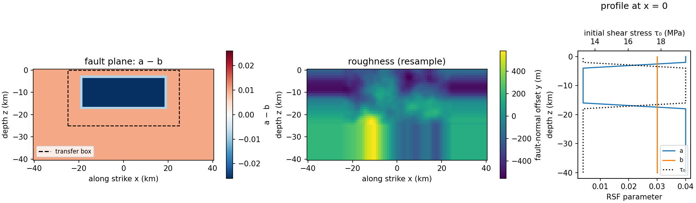

# bp1001.fdc.rough.1000

SEAS benchmark BP1001 as a fully dynamic earthquake cycle: EQquasi runs the
interseismic period, EQdyna the coseismic rupture, on one rough vertical
strike-slip fault with a 1 km on-fault grid.



| | |
|---|---|
| Fault | 80 km along strike × 40 km down dip, vertical, in the xz plane |
| Roughness | `par.roughness = dict(kind="resample", ...)`: derived at problem-conversion time from `bp1001.fdc.rough.250`'s `rough_heights.250.txt` (201 × 101 nodes at 250 m over x = ±25 km, z = −25…0 km), low-passed at a 2 km cutoff wavelength (`utils/roughness.resample`, a real-space Gaussian filter with reflect/mirror boundary handling) then decimated 4:1 to 51 × 26 nodes at 1 km, edge values repeated to the full fault grid; no 1 km heights file is kept |
| Material | elastic, vp 6000 m/s, vs 3464 m/s, ρ 2670 kg/m³ |
| Friction | rate-and-state, aging law; a = 0.004 in the velocity-weakening patch (\|x\| ≤ 18 km, 4 ≤ \|z\| ≤ 16 km), a + 0.036 outside, 2 km linear taper; b = 0.03, Dc = 0.14 m, f0 = 0.6, v0 = 1e-6 m/s |
| Initial stress | σn = −25 MPa; τ0 at steady state for the creep rate 1e-9 m/s |
| Loading | far-field 4e-10 m/s (EQquasi) |
| Cycles | `istart`–`iend` in `user_defined_params.py` |

`user_defined_params.py` loads `bp1001.fdc.rough.250`'s `par` (Rule 7 -- a
problem is defined once) and overrides only what the coarser grid changes:
`par.dx`, `par.roughness`, `par.eqdyna["casename"]`,
`par.eqdyna["nuni_y_plus"/"nuni_y_minus"]`, and `par.eqdyna["dt"]` (a formula
in `par.dx`). `create.newcase` converts the result into each code's
`user_defined_params.py` (`utils/convert.py`).

## Run

```
source checkout.sh
create.newcase fdc runs/bp1001.1000 bp1001.fdc.rough.1000
cd runs/bp1001.1000 && ./case.setup && ./case.submit
```

## Results

Not yet run with the pinned codes.

## Known issues

- Slopes (dy/dx, dy/dz) are never copied from the 250 m file:
  `roughness.heights()` calls `roughness.read()` on the 250 m file,
  `roughness.resample()` (low-pass + decimate) and places the result on the
  1 km fault grid; `roughness.write()` (run by `create.newcase`) always
  recomputes slopes as `np.gradient` of the final 1 km heights.
- The 2 km low-pass cutoff passes ~37% amplitude at the 2 km Nyquist
  wavelength of the 1 km output grid -- a known, separate gap
  (`utils/roughness.py`'s `resample` docstring), not fixed here.
- `par.eqdyna`'s `nuni_y_plus`/`nuni_y_minus` is re-derived, not copied: the
  250 m compset uses 70 cells for a 70 × 250 m = 17500 m physical buffer;
  here 18 cells gives 18 × 1000 m = 18000 m, the smallest whole cell count
  that does not shrink the buffer below 17500 m. `dt = 0.25*par.dx/par.vp`
  needs no such adjustment — it is already a formula in `par.dx` and scales
  automatically (0.0417 s at dx=1000 vs 0.0104 s at dx=250).
- Unlike the stored slope columns in `bp1001.fdc.rough.250`'s own
  `rough_heights.250.txt` (EQquasi's raw file, whose four boundary lines
  carry a literal 0 that does not match `np.gradient` of its own heights
  column -- max abs diff 0.146 m/m checked directly), this file's boundary
  slopes are the real one-sided `np.gradient` of the 1 km heights (max abs
  value 0.056 in x, 0.339 in z) because `roughness.write()` always
  recomputes slopes from heights, never copies a stored column.

Regenerate the figure with `python3 utils/plot_problem.py compset/bp1001.fdc.rough.1000`.
