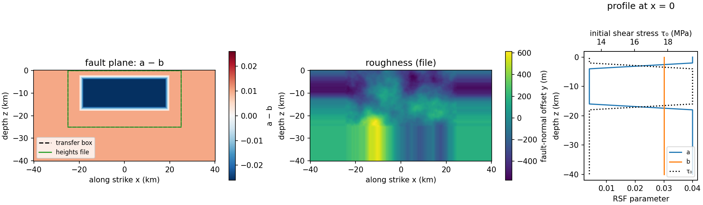

# bp1001.fdc.rough.250

SEAS benchmark BP1001 as a fully dynamic earthquake cycle: EQquasi runs the
interseismic period, EQdyna the coseismic rupture, on one rough vertical
strike-slip fault with a 250 m on-fault grid.



| | |
|---|---|
| Fault | 80 km along strike × 40 km down dip, vertical, in the xz plane |
| Roughness | heights from `rough_heights.250.txt` (EQquasi's bp1001 surface, 201 × 101 nodes at 250 m over x = ±25 km, z = −25…0 km), edge values repeated to the full fault grid |
| Material | elastic, vp 6000 m/s, vs 3464 m/s, ρ 2670 kg/m³ |
| Friction | rate-and-state, aging law; a = 0.004 in the velocity-weakening patch (\|x\| ≤ 18 km, 4 ≤ \|z\| ≤ 16 km), a + 0.036 outside, 2 km linear taper; b = 0.03, Dc = 0.14 m, f0 = 0.6, v0 = 1e-6 m/s |
| Initial stress | σn = −25 MPa; τ0 at steady state for the creep rate 1e-9 m/s |
| Loading | far-field 4e-10 m/s (EQquasi) |
| Cycles | `istart`–`iend` in `user_defined_params.py` |

`user_defined_params.py` is the only definition. `create.newcase` converts it
into each code's `user_defined_params.py` (`utils/convert.py`).

## Run

```
source checkout.sh
create.newcase fdc runs/bp1001 bp1001.fdc.rough.250
cd runs/bp1001 && ./case.setup && ./case.submit
```

## Results

Not yet run with the pinned codes. After a run, add the slip-rate and slip
history plots here.

## Known issues

- The surface both codes get is built by `utils/roughness.py`: the heights
  are EQquasi's, padded as EQquasi itself pads them, and the slopes are
  recomputed from the heights. The original file had zero slopes on its four
  boundary lines (3 % of nodes); those nodes now carry the true slope.
- EQdyna's old compset used σn = −50 MPa and creep rate 1e-16 m/s. Here both
  codes use the EQquasi values. In mode 2, EQdyna takes stress and state
  from the EQquasi restart.

Regenerate the figure with `python3 utils/plot_problem.py compset/bp1001.fdc.rough.250`.
