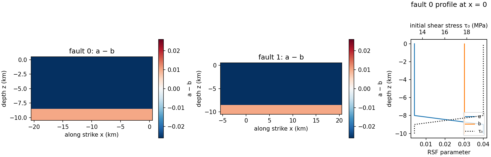

# test.stepover.2fault

A planar two-fault releasing stepover (`ntotft = 2`), 1 km grid. It is not a
benchmark: it tests the multi-fault path of `utils/convert.py` for both codes.

| | |
|---|---|
| Faults | x −20…0 km at y = 0, and x −5…20 km at y = −2 km; both z −10…0 km |
| Friction | rate-and-state, aging law; velocity-weakening for \|z\| ≤ 8 km |
| Initial stress | σn = −25 MPa on fault 1, −27 MPa on fault 2 |
| Mode | quasi-dynamic only; fdc with a stepover is blocked (`PATHWAY_FORWARD.md`) |
| Roughness | none; EQdyna refuses a rough fault with `ntotft > 1` |
